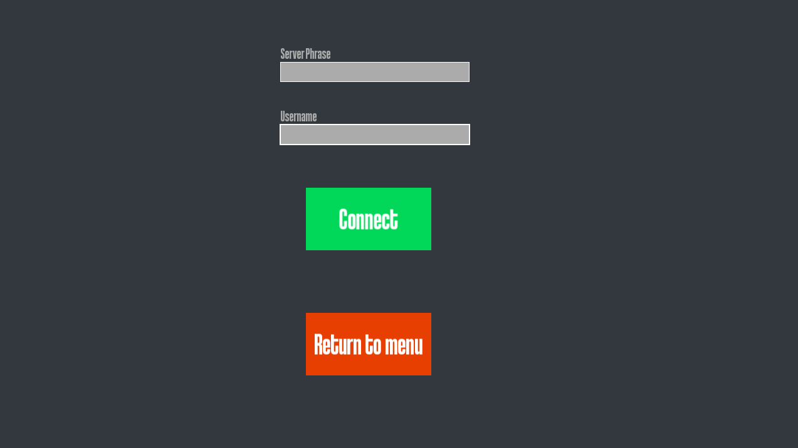
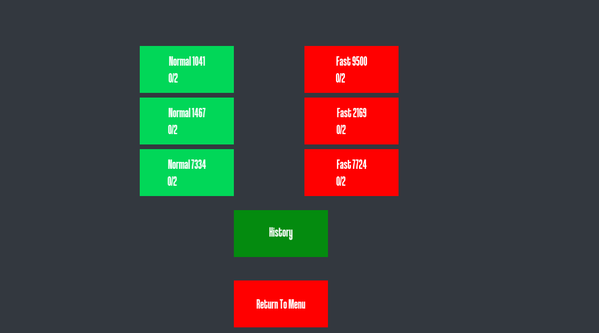
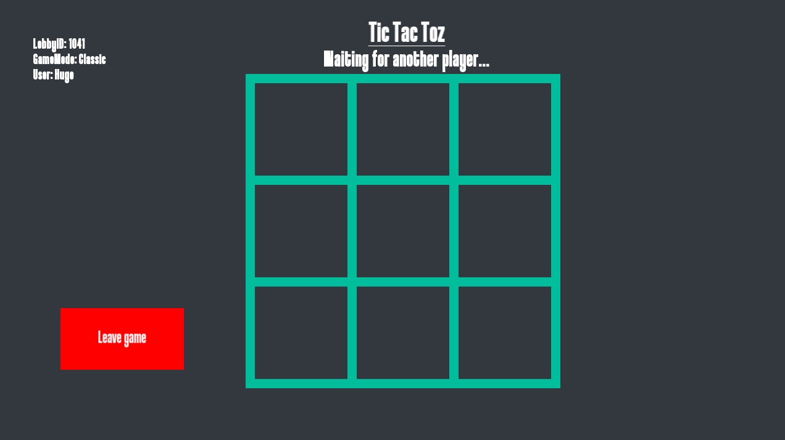
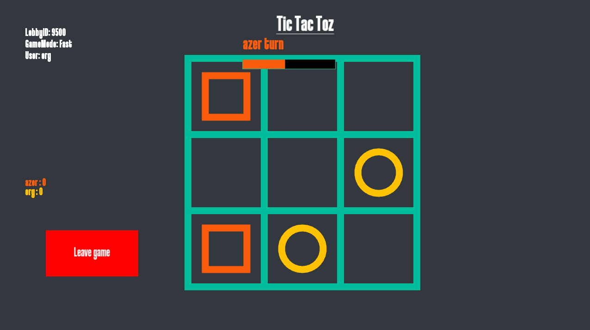
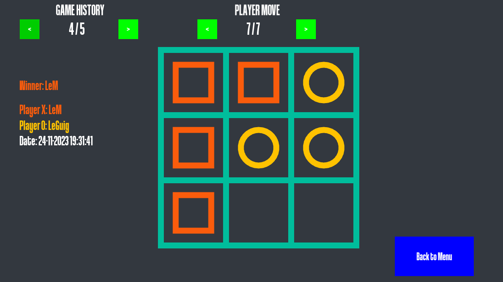
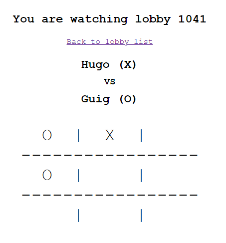

# TicTacToe-Online
## Context 
This project was made for the course of Windows Online Programing and Multi-Threading.  
The goal was to create a basic Tic Tac Toe game with a GUI and a server that can handle multiple games at the same time.

## FEATURES
- Basic TicTacToe game using the [SFML](https://www.sfml-dev.org/) and C++
    - View State to easily create multiple views (i.e : Home, Login, History, Lobby, Game)
    - Two different game modes
        - CLASSIC
        - FAST (PLayer turn timer is enabled)
- Server sending and receiving messages from multiple clients
    - 'send' and 'receive' procedure via Windows window events
        - Custom window messages
        - Send and Read data as json using [C++ json library](https://github.com/nlohmann/json)
    - Lobby management to manage multiple games
    - Send all sessions updates to a Web server
- Multi-threading paradigms and functionalities
    - Main client loop on the main threas
    - Receiving messages from server is running on an independent thread
- Web server to view all the started games

## How to use
1. Download the project in the GitHub release section.
2. Run the local server by executing the `Server.exe` file.
3. Run the client by executing the `Client.exe` file.
4. Enjoy the game!

**NOTE :** You can run multiple clients at the same time.  
**WARNING:** You need to be on the same network to connect to the server.

## How to play

> Make sure the server is running. :)

### Connection
When you start `Client.exe`, you will need to connect to the server with a PassPhrase.  
The PassPhrase can be found in the Server console with this form : ` => Game Server Phrase: PASSPHRASE`  

---

### Lobby
Once connected, you can enter in a **CLASSIC** or **FAST** lobby.  
(The fast game mode is really fun)

---

### Game
The game will automatically start when there is 2 players in the lobby.  
When the game is over, the server will automatically reset the board.  
If the opponent leave the lobby, the lobby will return to a waiting state.

---
|              Waiting               |             In Game (Fast)             |
|:----------------------------------:|:--------------------------------:|
|  |  |

### History
Once connected, you can view all the games played in the server.  

---

## How to access the web site

> Make sure the server is running. :)

When the server's started, an url will be printed in the console with this form : `=> Web Server Address: YOUR_IP`  
CTRL + Click to quick open the link in your browser.  

## CREDITS

### Supervisor
* [Sylvain SECCIA](https://www.seccia.com/)

### Collaborators
* [Hugo MAESTRACCI](https://github.com/sh4dy01)
* [Nathanael VOGT](https://github.com/Gotvna)
* [Jun](https://github.com/Juuunnne)
